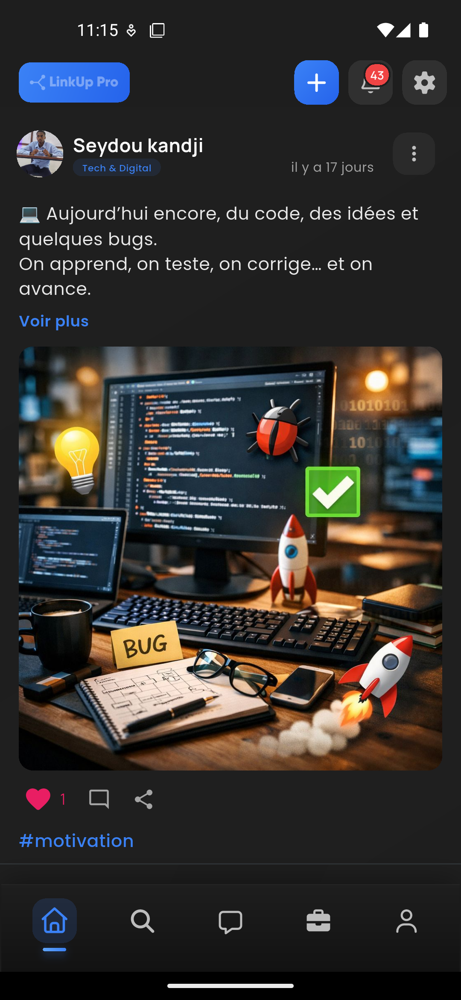

# LinkUp Pro 🚀

A modern Flutter application for seamless networking and professional connections.

[](https://flutter.dev/)
[](https://dart.dev/)
[](LICENSE)
[]()

## 📱 Features

- **Real-time Messaging** - Instant communication with professionals
- **Profile Management** - Comprehensive user profiles with skills and experience
- **Network Discovery** - Find and connect with industry professionals
- **Event Integration** - Join networking events and meetups
- **Cross-platform** - Available on iOS and Android
- **Offline Support** - Core features work without internet connection

## 📸 Screenshots

| Home Screen | Profile | Messages | Network |
|-------------|---------|----------|---------|
|  |  |  |  |

## 🚀 Getting Started

### Prerequisites

- Flutter SDK (3.0+)
- Dart SDK (3.0+)
- Android Studio / VS Code
- iOS Simulator / Android Emulator

### Installation

1. **Clone the repository**
   ```bash
   git clone https://github.com/yourusername/linkup_pro.git
   cd linkup_pro
   ```

2. **Install dependencies**
   ```bash
   flutter pub get
   ```

3. **Run the app**
   ```bash
   flutter run
   ```

### Configuration

1. Create a `.env` file in the root directory:
   ```env
   API_BASE_URL=https://api.linkuppro.com
   FIREBASE_PROJECT_ID=your-firebase-project
   ```

2. Configure Firebase (optional):
   - Add `google-services.json` for Android
   - Add `GoogleService-Info.plist` for iOS

## 🏗️ Project Structure

```
lib/
├── core/           # Core utilities and constants
├── data/           # Data layer (repositories, models)
├── features/       # Feature modules
│   ├── auth/       # Authentication
│   ├── profile/    # User profiles
│   ├── messaging/  # Chat functionality
│   └── network/    # Networking features
├── shared/         # Shared widgets and utilities
└── main.dart       # App entry point
```

## 🔧 Development

### Code Style

This project follows the [official Dart style guide](https://dart.dev/guides/language/effective-dart/style).

```bash
# Format code
dart format .

# Analyze code
dart analyze .

# Run tests
flutter test
```

### State Management

- **Provider** for simple state management
- **Bloc** for complex business logic
- **Riverpod** for dependency injection

## 📚 API Documentation

The app integrates with the LinkUp Pro API. Key endpoints:

- `GET /api/users/profile` - Get user profile
- `POST /api/messages` - Send message
- `GET /api/network/suggestions` - Get connection suggestions

## 🧪 Testing

```bash
# Run all tests
flutter test

# Run tests with coverage
flutter test --coverage

# Run integration tests
flutter drive --target=test_driver/app.dart
```

## 🚢 Deployment

### Android
```bash
flutter build apk --release
```

### iOS
```bash
flutter build ios --release
```

## 🤝 Contributing

1. Fork the repository
2. Create a feature branch (`git checkout -b feature/amazing-feature`)
3. Commit changes (`git commit -m 'Add amazing feature'`)
4. Push to branch (`git push origin feature/amazing-feature`)
5. Open a Pull Request

### Development Guidelines

- Follow the existing code style
- Write tests for new features
- Update documentation as needed
- Ensure all tests pass before submitting PR

## 📋 Roadmap

- [ ] Video calling integration
- [ ] Advanced search filters
- [ ] AI-powered connection recommendations
- [ ] Desktop application
- [ ] LinkedIn integration

## 🐛 Known Issues

- iOS: Camera permission dialog appears twice on first launch
- Android: Push notifications may not work on MIUI devices

## 📄 License

This project is licensed under the MIT License - see the [LICENSE](LICENSE) file for details.

## 👥 Authors

- **Your Name** - *Initial work* - [@yourusername](https://github.com/yourusername)

## 🙏 Acknowledgments

- Flutter team for the amazing framework
- Contributors and beta testers
- Open source packages used in this project

## 📞 Support

- **Email**: support@linkuppro.com
- **Documentation**: [docs.linkuppro.com](https://docs.linkuppro.com)
- **Issues**: [GitHub Issues](https://github.com/yourusername/linkup_pro/issues)

---

Made with ❤️ using Flutter
