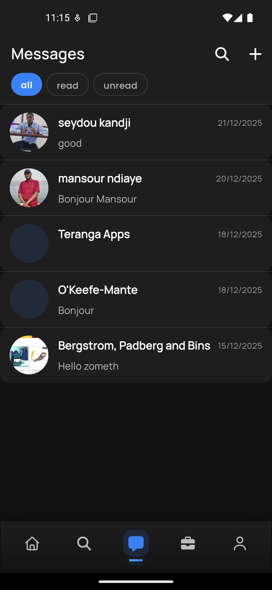
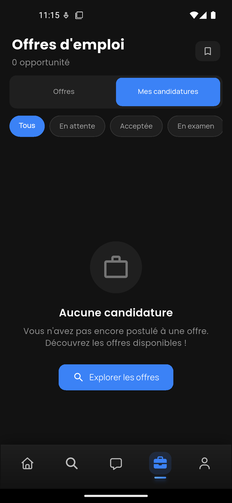

# LinkUp Pro - Application Mobile

Application mobile multiplateforme développée avec [Flutter](https://flutter.dev/), conçue pour une plateforme de réseautage professionnel. Cette application fournit une interface utilisateur moderne et fluide pour la gestion de profils, la messagerie, les publications, les offres d'emploi et bien plus encore.

## Fonctionnalités

- Architecture modulaire avec Flutter et Riverpod
- Authentification (JWT)
- Gestion des profils utilisateurs, compétences et expériences
- Publications, commentaires et interactions sociales
- Messagerie en temps réel avec Socket.IO
- Notifications push avec Firebase Messaging
- Recherche d'utilisateurs et de contenus
- Support multilingue (Français, Anglais, Arabe)
- Thème clair/sombre
- Mode hors-ligne avec mise en cache

## Technologies Utilisées

- [Flutter](https://flutter.dev/) (SDK ^3.10.0)
- [Dart](https://dart.dev/)
- [Riverpod](https://riverpod.dev/) (gestion d'état)
- [Dio](https://pub.dev/packages/dio) (requêtes HTTP)
- [Go Router](https://pub.dev/packages/go_router) (navigation)
- [Firebase](https://firebase.google.com/) (notifications, authentification)
- [Socket.IO](https://socket.io/) (messagerie temps réel)
- [Hive](https://pub.dev/packages/hive) (stockage local)
- [Easy Localization](https://pub.dev/packages/easy_localization) (internationalisation)

## Captures d'Écran

| Accueil | Profil | Messagerie | Offres d'emploi |
|---------|--------|------------|-----------------|
|  |  |  |  |

## Langues Supportées

L'application est entièrement traduite en **trois langues** :

| Langue | Code | Fichier |
|--------|------|---------|
| Français | `fr` | `assets/translations/fr.json` |
| Anglais | `en` | `assets/translations/en.json` |
| Arabe | `ar` | `assets/translations/ar.json` |

L'interface s'adapte automatiquement à la langue du système ou peut être changée manuellement dans les paramètres.

## Démarrage

### Prérequis

- Flutter SDK (3.10+)
- Dart SDK (3.0+)
- Android Studio / VS Code
- Émulateur Android ou Simulateur iOS

### Installation

```bash
flutter pub get
```

### Configuration

1. Créez un fichier `.env` à la racine du projet :
```env
API_BASE_URL=https://api.linkuppro.com
FIREBASE_PROJECT_ID=votre-projet-firebase
```

2. Configurez Firebase :
   - Ajoutez `google-services.json` dans `android/app/`
   - Ajoutez `GoogleService-Info.plist` dans `ios/Runner/`

### Lancement de l'Application

```bash
flutter run
```

### Exécution des Tests

```bash
flutter test
```

## Structure du Projet

```
lib/
  main.dart                 # Point d'entrée
  core/                     # Utilitaires et constantes
    constants/              # Constantes de l'application
    entities/               # Entités de données
    enums/                  # Énumérations
    error/                  # Gestion des erreurs
    network/                # Configuration réseau (Dio)
    providers/              # Providers Riverpod globaux
    routes/                 # Configuration Go Router
    services/               # Services partagés
    theme/                  # Thèmes et styles
    utils/                  # Fonctions utilitaires
    widgets/                # Widgets réutilisables
  features/                 # Modules fonctionnels
    auth/                   # Authentification
    login/                  # Connexion
    register/               # Inscription
    profile/                # Profil utilisateur
    profile_skills/         # Compétences
    profile_jobs/           # Expériences professionnelles
    posts/                  # Publications
    comments/               # Commentaires
    messages/               # Messagerie
    notifications/          # Notifications
    offers/                 # Offres d'emploi
    search/                 # Recherche
    settings/               # Paramètres
    users/                  # Utilisateurs
assets/
  images/                   # Images et icônes
  translations/             # Fichiers de traduction (ar, en, fr)
```

## Aperçu des Fonctionnalités

- **Authentification** : Connexion, inscription, Google Sign-In
- **Profil** : Gestion du profil, photo, biographie, compétences
- **Publications** : Création, modification, suppression de posts
- **Commentaires** : Système de commentaires imbriqués
- **Messagerie** : Chat en temps réel avec les utilisateurs
- **Notifications** : Notifications push pour les interactions
- **Recherche** : Recherche d'utilisateurs et de contenus
- **Paramètres** : Langue, thème, confidentialité

## Commandes Utiles

```bash
# Formater le code
dart format .

# Analyser le code
dart analyze .

# Générer le code Riverpod
dart run build_runner build

# Build APK (Android)
flutter build apk --release

# Build iOS
flutter build ios --release

# Générer les icônes de l'application
flutter pub run flutter_launcher_icons

# Générer le splash screen
flutter pub run flutter_native_splash:create
```

## Contribution

1. Forkez le dépôt
2. Créez votre branche (`git checkout -b feature/MaFonctionnalite`)
3. Commitez vos modifications (`git commit -am 'Ajout d'une nouvelle fonctionnalité'`)
4. Poussez vers la branche (`git push origin feature/MaFonctionnalite`)
5. Créez une Pull Request

## Licence

Ce projet est sous licence MIT.
